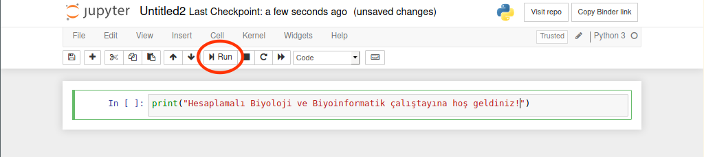
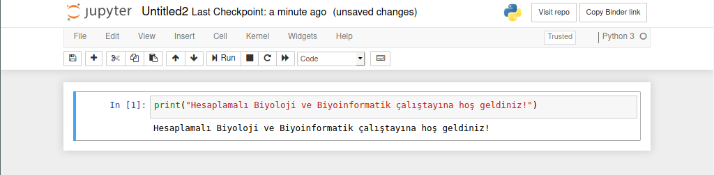

# Hesaplamalı Biyoloji ve Biyoinformatiğe Giriş
05.02.2020 tarihinde Hacettepe Üniversitesi Ekoloji Grubu Topluluğu tarafından düzenlenen 5. Hacettepe Biyoloji ve Uygulamaları Kongresi dahilindeki "Hesaplamalı Biyoloji ve Biyoinformatiğe Giriş" isimli çalıştayına ait ders notları ve verileri içerir.

## Gerekli Programların İndirilmesi 

Açıklamalar Windows işletim sistemine yöneliktir.

https://www.anaconda.com/distribution/#download-section adresi üzerinden <b>Python 3.7</b> indirilir ve program kurulur.

Windows başlangıç menüsünden <b>[Anaconda3(64 bit)] → [Jupyter Notebook]</b> seçilir. Bu işlem Jupyter'i tarayıcınızın bir sekmesinde açar.

Açılan sayfanın sağ üst kısmından  <b>[New] → [Python 3]</b> seçilir.

Jupyter not defteriniz, tarayıcınızın yeni bir sekmesinde açılacaktır:

## Alternatif yol: Gerekli Programların Tarayıcı Üzerinden Kullanılması

Alternatif olarak Python Jupyter Notebook'u tarayıcınız üzerinden kullanabilirsiniz.

https://jupyter.org/try adresine girilerek <b>Try Classic Notebook</b> seçeneği seçilir.

Açılan sayfanın sol üst kısmından  <b>[File] → [New Notebook] → [Python 3]</b> seçilir.

## Kodların Çalıştırılması

Yazılan kodlar <b>Run</b> butonuna tıklanarak veya <b> Ctrl + Enter </b> tuşlarına aynı anda basılarak çalıştırılabilir:

Çıktı (Output):

