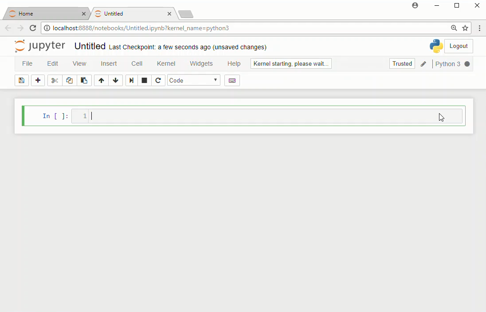

# Hesaplamalı Biyoloji ve Biyoinformatiğe Giriş
05.02.2020 tarihinde Hacettepe Üniversitesi Ekoloji Grubu Topluluğu tarafından düzenlenen 5. Hacettepe Biyoloji ve Uygulamaları Kongresi dahilindeki "Hesaplamalı Biyoloji ve Biyoinformatiğe Giriş" isimli çalıştayına ait ders notları ve verileri içerir.

## Gerekli Programların İndirilmesi 

Açıklamalar Windows işletim sistemine yöneliktir.

https://www.anaconda.com/distribution/#download-section linki üzerinden <b>Python 3.7</b> indirilir.

Windows başlangıç menüsünden <b>[Anaconda3(64 bit)] → [Jupyter Notebook]</b> seçilir. Bu işlem Jupyter'i tarayıcınızın bir sekmesinde açar.

Açılan sayfanın sağ üst kısmından  <b>[New] → [Python 3]</b> seçilir.

Jupyter not defteriniz, tarayıcınızın yeni bir sekmesinde açılacaktır:

## Gerekli Programların Tarayıcı Üzerinden Kullanılması

https://jupyter.org/try adresi
