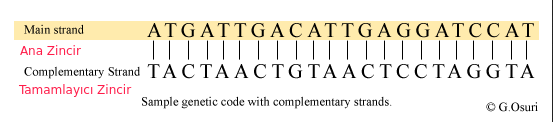

# Hesaplamalı Biyoloji ve Biyoinformatiğe Giriş
# Uygulamalar

## Problem 3

Tamamlayıcı DNA (Complementary DNA)

#### Örnek Verilen:

'dizi3' isimli bir DNA dizisi.

Örnek veri:

> ACTGATCGATTACGTATAGTATTTGCTATCATACATATATATCGATGCGTTCAT

#### Örnek İstenen:

String; `dizi3`'ün tamamlayıcı zincirini içeren DNA dizisi.

Örnek çıktı:

> TGACTAGCTAATGCATATCATAAACGATAGTATGTATATATAGCTACGCAAGTA

### Problem 3 İçin Veri:

GenBank ID'si <b> MG925459.1 </b> olan DNA dizisini <b> NCBI veritabanı </b> üzerinden bulup, <b> FASTA </b> formatındaki verisine ulaşınız.

Veriden kopyaladığınız DNA dizisini <b> Noccaea_papillosa_2 </b> isimli bir değişkene atayınız.

<b> Dikkat! </b> FASTA formatı satırlardan oluştuğu için, veri kopyalandıktan sonra Python üzerinden bu veriyle çalışırken bütün DNA dizisinin bütün bir halde, tek bir satır halinde bir diziye çevirilmesi gerekiyor.

Bu DNA dizisinin tamamlayıcı zincirini bulunuz.
