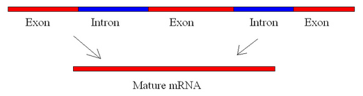

# Hesaplamalı Biyoloji ve Biyoinformatiğe Giriş
# Uygulamalar

## Problem 4

Eksonlar DNA'nın protein kodlayan, intronlar ise kodlamayan kısımlarıdır.

### Problem 4 İçin Veri:

### Kısım 1: İntron'ları kesip atmak

> ATCGATCGATCGATCGACTGACTAGTCATAGCTATGCATGTAGCTACTCGATCGATCGATCGATCGATCGATCGATCGATCGATCATGCTATCATCGATCGATATCGATGCATCGACTACTAT

Ekson ve intron bölgelerinden oluşan bir DNA dizisi verilmiştir.

-İlk ekson dizinin başından 63. karaktere kadar olan kısmı kapsamaktadır.

-ikinci ekson ise 91. karakterden dizinin sonuna kadar olan kısmı kapsamaktadır.

Sadece kodlayan dizileri yazdıracak bir program yazınız.

### Kısım 2: Kodlayan DNA yüzdesinin hesaplanması

Birinci kısımda elde ettiğiniz veriyi kullanarak, verilen DNA dizisinin yüzde kaçının kodlayan dizi olduğunu hesaplayınız.

### Kısım 3: DNA dizisini yeniden yazmak

Birinci kısımda elde ettiğiniz veriyi kullanarak, orijinal DNA dizisini kodlayan bölgeleri büyük harf, kodlamayan bölgeleri küçük harf olacak şekilde tekrar yazdırınız.
