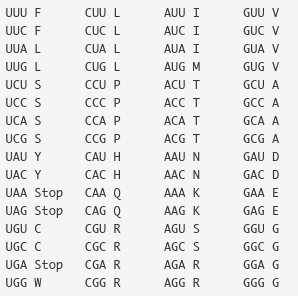

# Hesaplamalı Biyoloji ve Biyoinformatiğe Giriş
# Uygulamalar

## Problem 6 - Bonus Soru: Translasyon

#### Örnek Verilen:

Bir RNA dizisi, string.

Örnek veri:

> AUGGCCAUGGCGCCCAGAACUGAGAUCAAUAGUACCCGUAUUAACGGGUGA

#### Örnek İstenen:

Bir protein dizisi, string.

Örnek çıktı:

> MAMAPRTEINSTRING

### Problem 6 İçin Veri:

> AUGAACGGGGCCAUGAAGGAACGGGGUAACGGGGCCAUGAAGGAACGGGAUGGCGGGGCCAAGGAACGGGAUGGUUAG

Kaynak önerileri:
http://rsgturkey.com/en/resources/
